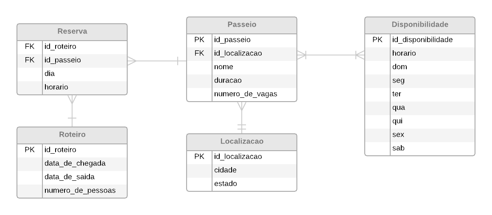

# API de roteiros de viagem

Em uma viagem, diversos tipos de passeios podem ser realizados. 
Esta API tem objetivo de criar um roteiro de passeios para uma viagem, 
escalando e organizando os mesmos conforme a data e o número de pessoas
participantes da viagem.

Para possibilitar a persistencia dos dados, 
o seguinte modelo ER foi empregado:



## Como rodar a aplicação no Linux:

Para rodar a aplicação deve-se ter o python 3 instalado.
Também é necessário instalar alguns requerimentos, mas antes disso, 
aconselho criar um ambiente virtual com virtualenv.
Para isso, deve-se clonar este repositório, entrar no diretório e  
executar os seguintes comandos no terminal:

1. `pip3 install virtualenv`
2. `virtualenv env`
3. `source env/bin/activate`
4. `pip install -r requirements.txt`
5. `python manage.py makemigrations`
6. `python manage.py migrate`
7. `python manage.py runserver`

Para verificar se a instalação foi realizada com sucesso, 
acesse a API Django REST framework pelo endereço http://127.0.0.1:8000.

## Trabalhando com a API

Esta API é baseada em duas aplicações príncipais, roteiro e passeios.
Cada aplicação possui um endpoint para ler (GET) e criar (POST) os respectivos
roteiros e passeios. 

Uma ferramenta interessante para testar a API é o Postman, 
que pode ser encontrado em https://www.getpostman.com/downloads/.  

### Adicionando passeios:

Um passeio é constituído pelos atributos, nome, duração, número de vagas,
localização e disponibilidade. Este último é referente aos horários disponiveis
e pode ser mais de um.

Os passeios podem ser acessados e criados através do endpoint: 
http://127.0.0.1:8000/passeios/.
Para adição de um novo passeio, o seguinte formato JSON deve ser utilizado:

```json
{
    "nome": "Nome do passeio",
    "duracao": "YYYY-MM-DD",
    "numero_de_vagas": 20,
    "localizacao": {
        "cidade": "Florianópolis",
        "estado": "SC"
    },
    "disponibilidade": [
        {
            "id": 1,
            "horario": "09:00:00",
            "sun": true,
            "mon": true,
            "tue": true,
            "wed": false,
            "thu": false,
            "fri": true,
            "sat": true
        }
    ]
}
```

### Criando roteiro:

Endpoint para criação (POST) e listagem (GET) dos roteiros: http://127.0.0.1:8000/roteiro/

Formato application/json para criação (POST) do roteiro:

```json
{
    "data_de_chegada": "YYYY-MM-DD",
    "data_de_saida": "YYYY-MM-DD",
    "numero_de_pessoas": 2,
    "passeios": [
        1,
        2,
        4,
        6
    ]
}
```
A API irá retornar um JSON com os horários marcados para cada passeio.
Caso não haja disponibilidade de horário, uma mensagem é retornada.

### Rodando os testes (em desenvolvimento):

Para rodar os testes deve-se executar, na mesma pasta do manager.py, o seguinte comando:

`python manager.py test roteiro -v 2`
